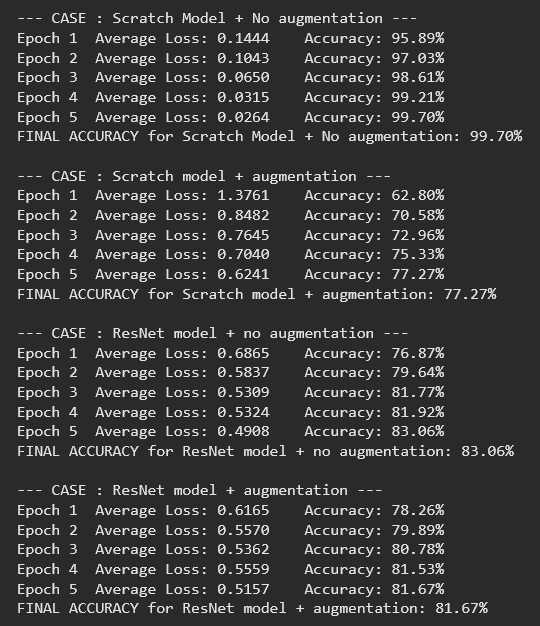
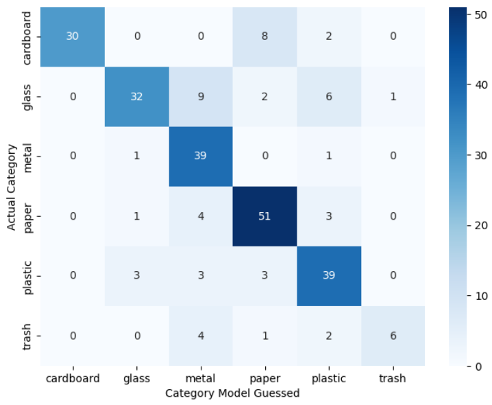
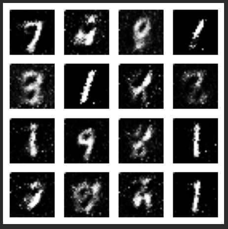

# Image Classification + GAN task

--------------GARBAGE CLASSIFICATION TASK-------------------

Google Colab link : https://colab.research.google.com/drive/1vXjLgN1kmcy949KkZcRnAtybTPpkgWN_?usp=sharing

Model Architectures:

For this task, I implemented and compared the result of a custom CNN model and ResNet (pre-trained) model via augmented and non-augmented (simple) transformations of the garbage dataset.

1) Custom CNN (Scratch):
     Implemented a 3-layer Convolutional Neural Network designed to learn spatial features from the garbage dataset.
     It includes Conv2d layers to scan the images for edges and shapes.
     MaxPool2d to shrink the images and focus on the most important features
     Fully Connected layers for the final 6-class classification.

2) ResNet-18 (Transfer Learning):
     I utilized a pre-trained ResNet-18 model
     Pre-trained weights: It already knows how to recognize objects because it was trained on 1 million images (ImageNet).
     Freezing: kept the early layers "frozen" so it does not loses the pre-trained knowledge.
     Match 6-category garbage: replaced the very last layer with a new one that specifically looks for our 6 types of garbage.

Final Results: 

I conducted four experimental trials to determine the most robust and reliable model.

Case                         |               Accuracy	                 Reliability

Scratch + No Augmentation	               99.70%	              Low (Overfitting)

Scratch + Augmentation	                    77.27%	                    Medium

ResNet-18 + No Augmentation	               83.06%	                     High

ResNet-18 + Augmentation	                    81.67%	          Highest (Best Generalization)

Final accuracies of all combinations

Confusion Matrix represented by Heatmap

------------------GAN TASK------------------ 

Google Colab link : https://colab.research.google.com/drive/1SERfZTzy2UJV0VODUVGn74wJzATovrq0?usp=sharing

Model architures used :

GAN (Generative Adversarial Network) 

1. The Generator 

    Input: It accepts a 100-dimensional Latent Vector (z) of random noise as its "seed".
    Architecture: It consists of a series of Fully Connected (Linear) layers.
    Activations: It uses ReLU for the hidden layers to promote efficient feature mapping.
    Final Layer: It uses a Tanh activation to ensure the output pixels range between -1 and 1, matching your normalized dataset.

2. The Discriminator 

     This model acts as a binary classifier to distinguish between real and fake data.
     Structure: It uses a funnel-like series of Linear layers (e.g., 784 → 512 → 256 → 1).
     Activations: It uses LeakyReLU (0.2 slope) to prevent the "Dying ReLU" problem, ensuring it always provides a gradient back to the Generator.
     Output: It ends with a Sigmoid to produce a probability value between 0 (Fake) and 1 (Real).

3. Training & Optimization

    Loss Function: used Binary Cross Entropy (BCE), which is the standard for 0/1 classification tasks.
    Optimizers: utilized the Adam optimizer for both networks with a learning rate of 0.0002.
    Normalization: The dataset was transformed to a [-1, 1] range using transforms. Normalize((0.5,), (0.5,)) to maintain consistency with the Generator's Tanh output.

4. Performance Metrics

    Loss Tracking: recorded both Generator and Discriminator loss at every batch, resulting in a "spiky" graph.
    The final result is a 4x4 grid of generated digits, handwritten-like numbers from the MNIST distribution.

Generated numbers

   

